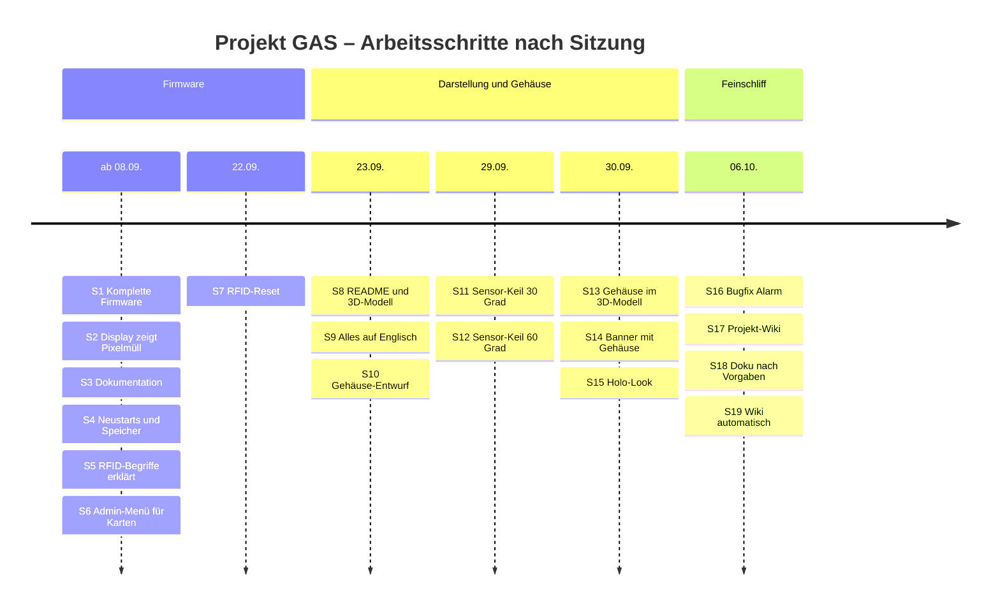
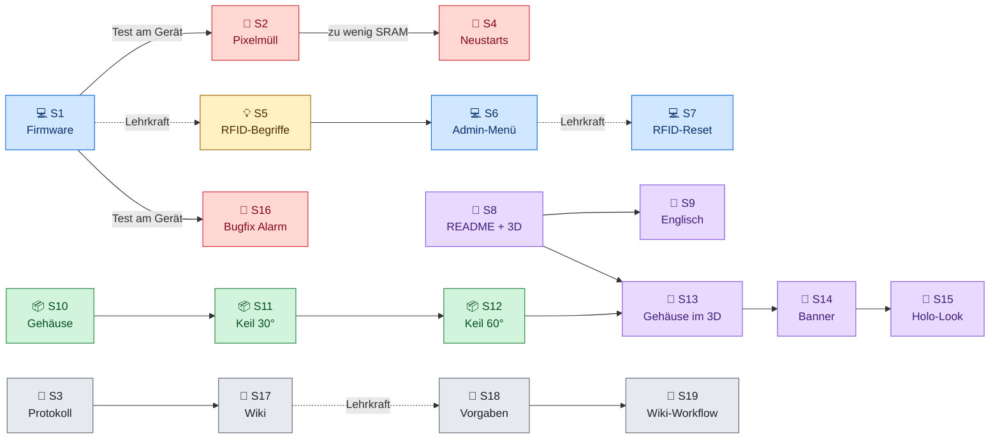
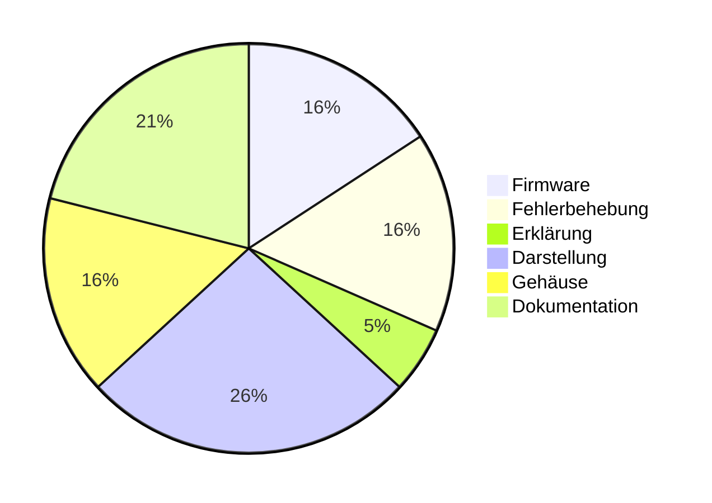

<!-- Diese Seite wird automatisch aus dem Ordner wiki/ im Repository erzeugt. Änderungen im Wiki-Editor werden beim nächsten Abgleich überschrieben. Bearbeiten: https://github.com/BBZ-AIFS51/LF7-Projekt_GAS/tree/main/wiki -->
# 🧭 Entwicklungsverlauf

Anhang

Die Firmware, das 3D-Modell und das Gehäuse sind Schritt für Schritt entstanden,
mit dem KI-Assistenten **Claude Code** als Hilfsmittel (siehe
[KI-Einsatz](KI-Einsatz)). Diese Seite zeigt den Verlauf als Zeitleiste: pro
Arbeitsschritt, was wir erreichen wollten oder welches Problem auftrat, und was
dabei herauskam.

> [!TIP]
> Das ausführliche Arbeitsprotokoll liegt im Repository unter
> [MDs/entwicklungsverlauf.md](https://github.com/BBZ-AIFS51/LF7-Projekt_GAS/blob/main/MDs/entwicklungsverlauf.md).
> Unter jeder Karte führt ein Link direkt zum passenden Eintrag.

| **19** | **6** | **3** | **2** |
|:---:|:---:|:---:|:---:|
| Arbeitsschritte | Sitzungen | Fehler gefunden und behoben | Anregungen der Lehrkraft umgesetzt |

## Überblick

### Zeitleiste

### Wie die Schritte aufeinander aufbauen

Kaum ein Schritt steht für sich. Meist hat ein Ergebnis die nächste Frage
ausgelöst: ein Fehler beim Testen, eine Anregung der Lehrkraft oder eine neue
Idee.

Durchgezogene Pfeile: Ergebnis führt direkt zum nächsten Schritt · gestrichelt: Anregung der Lehrkraft

### Themenbereiche

<table>
<tr>
<td width="55%">

| | Bereich | Schritte |
|:---:|---|---|
| 💻 | Firmware-Funktionen | 1, 6, 7 |
| 🐞 | Fehlerbehebung | 2, 4, 16 |
| 💡 | Erklärung / Wissen | 5 |
| 🎨 | Darstellung (README, 3D-Modell, Grafiken) | 8, 9, 13, 14, 15 |
| 📦 | Gehäuse | 10, 11, 12 |
| 📝 | Dokumentation | 3, 17, 18, 19 |

</td>
<td width="45%">

</td>
</tr>
</table>

---

## 📆 Ab 08.09.2026 · Die Firmware entsteht

Die Schritte 1–6 sind im Protokoll nicht einzeln datiert. Sie liegen zwischen der ersten Sitzung am 08.09. und dem 22.09.

### 💻 Schritt 1 — Auftrag: komplette Firmware

**Wir wollten:** die komplette Firmware für unser Mini-Sicherheitssystem, mit PIN, Totenkopf und Herz, Tönen und 30-Sekunden-Alarm.

**Ergebnis**
- Zustandsautomat: Unscharf → Ausgangsverzögerung → Scharf → Alarm
- PIN-Eingabe mit `*`-Maske, Bestätigung mit <kbd>#</kbd>, Löschen mit <kbd>*</kbd>
- Nicht blockierende Töne: heller Doppelton, rauer Fehlerton, Sirenen-Sweep 30 s
- **Von der KI ergänzt:** 10 s Ausgangsverzögerung, damit man sich beim Verlassen des Raums nicht selbst auslöst

> [!WARNING]
> **Offen:** Der Sketch konnte von der KI nicht kompiliert werden. Bauen und Testen in der Arduino IDE lag bei uns.

📄 [`alarm_system.ino`](https://github.com/BBZ-AIFS51/LF7-Projekt_GAS/blob/main/Code/alarm_system/alarm_system.ino) · 🔗 [Vollständiger Eintrag](https://github.com/BBZ-AIFS51/LF7-Projekt_GAS/blob/main/MDs/entwicklungsverlauf.md#1-prompt--auftrag-komplette-firmware)

### 🐞 Schritt 2 — Display zeigt Pixelmüll

**Problem:** Das Display zeigt weder Herz noch Totenkopf, nur der Sekunden-Countdown ist zu erahnen.

**Ergebnis**
- **Ursache:** zu wenig Arbeitsspeicher. Der Uno hat 2048 Byte, das Display belegt allein 1024. Der Stack lief in den Display-Puffer.
- Neuer isolierter Test [`display_test.ino`](https://github.com/BBZ-AIFS51/LF7-Projekt_GAS/blob/main/Code/display_test/display_test.ino), der den freien SRAM ausgibt
- Firmware sparsamer: alle Texte mit `F()` im Flash, kein `snprintf`, keine Textpuffer

🔗 [Vollständiger Eintrag](https://github.com/BBZ-AIFS51/LF7-Projekt_GAS/blob/main/MDs/entwicklungsverlauf.md#2-prompt--display-zeigt-pixelmüll)

### 📝 Schritt 3 — Dokumentation

**Wir wollten:** alle Arbeitsschritte und Ergebnisse als Protokoll festhalten.

**Ergebnis**
- Das Protokoll [`entwicklungsverlauf.md`](https://github.com/BBZ-AIFS51/LF7-Projekt_GAS/blob/main/MDs/entwicklungsverlauf.md). Es wird seitdem bei jeder Änderung fortgeschrieben und ist die Grundlage dieser Seite.

🔗 [Vollständiger Eintrag](https://github.com/BBZ-AIFS51/LF7-Projekt_GAS/blob/main/MDs/entwicklungsverlauf.md#3-prompt--dokumentation)

### 🐞 Schritt 4 — Neustarts beim Scharfschalten, Text soll weg

**Problem:** Nach einmal Scharf- und Unscharfschalten wird die richtige PIN als falsch erkannt. Außerdem soll das Display nur Symbole zeigen, und der Countdown ist abgeschnitten.

**Ergebnis**
- **Diagnose aus unserem Log:** Die Zeile bricht mitten im Wort ab, danach erscheint wieder der Startbildschirm. Der Arduino startet also neu, weil nur 205 Byte SRAM frei sind.
- Keypad-Library entfernt, die Tastenmatrix wird selbst gescannt (spart ~120 Byte)
- Display zeigt nur noch Symbole. Der Countdown ragte unten über den Rand und sitzt jetzt höher.

🔗 [Vollständiger Eintrag](https://github.com/BBZ-AIFS51/LF7-Projekt_GAS/blob/main/MDs/entwicklungsverlauf.md#4-prompt--resets-beim-scharfschalten-text-soll-weg)

### 💡 Schritt 5 — Kollisionserkennung und Rechtevergabe bei RFID

**Frage:** Was meint unsere Lehrerin mit „Kollisionserkennung“ und „Rechtevergabe“ bei RFID?

**Ergebnis**

| Begriff | Ebene | Bei uns |
|---|---|---|
| **Kollisionserkennung** | Protokoll (ISO 14443A): Liegen mehrere Karten im Feld, fragt der Leser die UID Bit für Bit ab, bis genau eine Karte übrig bleibt | erledigt die MFRC522-Library, `PICC_HaltA()` schickt die gelesene Karte schlafen |
| **Rechtevergabe** | Anwendung: Wer darf was? | damals nur eine feste Liste erlaubter Karten im Code |

Bewusst nur erklärt, nicht umgesetzt. Die Umsetzung folgte in Schritt 6.

🔗 [Vollständiger Eintrag](https://github.com/BBZ-AIFS51/LF7-Projekt_GAS/blob/main/MDs/entwicklungsverlauf.md#5-prompt--kollisionserkennung-und-rechtevergabe-bei-rfid)

### 💻 Schritt 6 — Rechtevergabe umsetzen: Karten außerhalb des Codes verwalten

**Wir wollten:** Karten hinzufügen und sperren können, ohne den Code zu ändern. Erst planen, dann umsetzen.

**Ergebnis**
- 💬 **Rückfrage der KI** zur Bedienung. Unsere Entscheidung: nur über Keypad und Display (kein PC), Löschen statt Sperrliste
- Karten liegen im **EEPROM** und überstehen ein neues Hochladen, maximal 8 Karten
- **Admin-Menü:** <kbd>A</kbd> + Admin-PIN, dann <kbd>1</kbd> Karte anlernen (einfach auflegen) und <kbd>2</kbd> Liste durchblättern / mit <kbd>D</kbd> löschen
- Eine falsche Admin-PIN zählt als Fehlversuch (Schutz gegen Durchprobieren)

🔗 [Vollständiger Eintrag](https://github.com/BBZ-AIFS51/LF7-Projekt_GAS/blob/main/MDs/entwicklungsverlauf.md#6-prompt--rechtevergabe-umsetzen-uids-außerhalb-des-codes-verwalten)

---

## 📆 22.09.2026 · RFID-Reset

### 💻 Schritt 7 — RFID-Reset

**Anlass:** Die Lehrerin hat bei einer anderen Gruppe angemerkt, dass sich das RFID-Modul aufhängen kann.

**Ergebnis**
- 💬 **Rückfrage der KI:** manuell, automatisch oder gar nicht? Unsere Entscheidung: nur manuell
- Taste <kbd>B</kbd> im Zustand Unscharf startet den Leser neu und prüft danach, ob er wieder antwortet (OK- oder Fehlerton)
- Reine Software-Lösung, die Reset-Leitung war schon verdrahtet

> [!WARNING]
> **Offen:** am echten Aufbau testen, ob <kbd>B</kbd> einen hängenden Leser wirklich wiederbelebt.

🔗 [Vollständiger Eintrag](https://github.com/BBZ-AIFS51/LF7-Projekt_GAS/blob/main/MDs/entwicklungsverlauf.md#7-prompt--rfid-reset-22092026)

---

## 📆 23.09.2026 · README, 3D-Modell und Gehäuse

### 🎨 Schritt 8 — 3D-Animationen und neue README

**Anlass:** Das Repository einer befreundeten Gruppe ([LF7-MiniCasino](https://github.com/BBZ-AIFS51/LF7-MiniCasino)) hatte animierte 3D-Grafiken. So etwas wollten wir auch.

**Ergebnis**
- Drei animierte SVG-Grafiken für die README: Banner, Zustandsautomat, Verdrahtung
- **Interaktives 3D-Modell** im Browser (three.js). Die Firmware-Logik ist nach JavaScript übertragen, Tasten, Karten und Bewegungsmelder sind anklickbar.
- Veröffentlichung über GitHub Pages, README komplett neu

▶ [3D-Modell öffnen](https://bbz-aifs51.github.io/LF7-Projekt_GAS/) · 🔗 [Vollständiger Eintrag](https://github.com/BBZ-AIFS51/LF7-Projekt_GAS/blob/main/MDs/entwicklungsverlauf.md#8-prompt--3d-animationen-und-neue-readme-23092026)

### 🎨 Schritt 9 — README, Grafiken und 3D-Modell auf Englisch

**Wir wollten:** README und 3D-Modell auf Englisch, damit das Repository auch international verständlich ist.

**Ergebnis**
- README, alle drei SVG-Grafiken und die komplette Oberfläche des 3D-Modells übersetzt
- Die deutschen Dokumente bleiben deutsch und sind in der README als „(German)“ markiert

🔗 [Vollständiger Eintrag](https://github.com/BBZ-AIFS51/LF7-Projekt_GAS/blob/main/MDs/entwicklungsverlauf.md#9-prompt--readme-grafiken-und-viewer-auf-englisch-23092026)

### 📦 Schritt 10 — Gehäuse für den 3D-Druck

**Wir wollten:** ein Gehäuse für den 3D-Druck, ohne Vorerfahrung. Der Bewegungsmelder muss auf der anderen Seite der Tür sitzen, damit er nicht schon beim Entsperren auslöst.

**Ergebnis**
- **Zwei Gehäuse, ein Kabel:** Bedienteil außen (90 × 176 × 45 mm), Sensorteil innen. Der Bewegungsmelder sieht nicht durch die Wand.
- Parametrisches OpenSCAD-Modell, alle Maße als Variablen
- Druckteile ohne Stützstrukturen, dazu eine Einsteiger-Anleitung: Nachmessen, Slicen, Einkaufsliste, Zusammenbau

> [!WARNING]
> **Offen:** Die Modulmaße stammen aus Datenblättern und sind nicht nachgemessen. Gedruckt ist noch nichts.

📄 [`gehaeuse.md`](https://github.com/BBZ-AIFS51/LF7-Projekt_GAS/blob/main/MDs/gehaeuse.md) · 🔗 [Vollständiger Eintrag](https://github.com/BBZ-AIFS51/LF7-Projekt_GAS/blob/main/MDs/entwicklungsverlauf.md#10-prompt--gehäuse-für-den-3d-druck-23092026)

---

## 📆 29.09.2026 · Der Sensor dreht sich zur Tür

### 📦 Schritt 11 — Sensor schräg zur Tür

**Wir wollten:** Der Sensor soll leicht angewinkelt sitzen und den ganzen Eingang abdecken.

**Ergebnis**
- Neues Druckteil: **Keil mit 30°**, auf den das Sensorteil geschraubt wird
- Montageskizze angepasst, das Türscharnier liegt jetzt auf der anderen Seite (sonst stünde die offene Tür im Sichtfeld)

🔗 [Vollständiger Eintrag](https://github.com/BBZ-AIFS51/LF7-Projekt_GAS/blob/main/MDs/entwicklungsverlauf.md#11-prompt--sensor-schräg-zur-tür-29092026)

### 📦 Schritt 12 — Sensor noch stärker zur Tür

**Wir wollten:** noch mehr Abdeckung der Tür. Der Erfassungsbereich soll sich stark mit der Wand überschneiden.

**Ergebnis**
- Keil von 30° auf **60°**. Die türseitige Kante des Erfassungsbereichs läuft jetzt ca. 25° in die Wand hinein.

<table>
  <tr>
    <td align="center" width="50%"> Draufsicht: Erfassungsbereich</td>
    <td align="center" width="50%"> Sensorteil auf dem 60°-Keil</td>
  </tr>
</table>

🔗 [Vollständiger Eintrag](https://github.com/BBZ-AIFS51/LF7-Projekt_GAS/blob/main/MDs/entwicklungsverlauf.md#12-prompt--sensor-noch-stärker-zur-tür-29092026)

---

## 📆 30.09.2026 · Das Gehäuse kommt ins 3D-Modell

### 🎨 Schritt 13 — Vorschaubilder, Gehäuse im 3D-Modell, Social Preview

**Wir wollten:** schönere Vorschaubilder, das Gehäuse im 3D-Modell (durchsichtig oder umschaltbar) und ein Vorschaubild für GitHub.

**Ergebnis**
- Neuer Tab **Enclosure** im 3D-Modell, gebaut aus den echten STL-Dateien. Das Gehäuse lässt sich massiv, durchsichtig oder ausgeblendet zeigen und aufklappen.
- Alle Gehäusebilder neu gerendert, dazu ein neues Bild der Druckplatte
- Social Preview im GitHub-Format (1280 × 640 px)

▶ [Enclosure-Tab öffnen](https://bbz-aifs51.github.io/LF7-Projekt_GAS/#enclosure) · 🔗 [Vollständiger Eintrag](https://github.com/BBZ-AIFS51/LF7-Projekt_GAS/blob/main/MDs/entwicklungsverlauf.md#13-prompt--vorschaubilder-gehäuse-im-3d-viewer-social-preview-30092026)

### 🎨 Schritt 14 — Banner und Social Preview mit Gehäuse

**Wir wollten:** Auch Banner und Social Preview sollen das Gerät im Gehäuse zeigen.

**Ergebnis**
- Das Banner zeigt das Bedienteil im Gehäuse und daneben das Sensorteil auf dem Keil, die Animation läuft wie vorher
- Social Preview mit massivem Gehäuse

🔗 [Vollständiger Eintrag](https://github.com/BBZ-AIFS51/LF7-Projekt_GAS/blob/main/MDs/entwicklungsverlauf.md#14-prompt--banner-und-social-preview-mit-gehäuse-30092026)

### 🎨 Schritt 15 — Holo-Look für Banner und Social Preview

**Wir wollten:** das Gehäuse durchsichtig zeigen, wie im X-ray-Modus des 3D-Modells.

**Ergebnis**
- Das Banner ist jetzt ein Render aus dem 3D-Modell mit durchsichtigem Gehäuse. Die Animation liegt als eigene Ebene passgenau darüber.
- Das Banner wird per Skript erzeugt (`node tools/render.mjs banner`)

🔗 [Vollständiger Eintrag](https://github.com/BBZ-AIFS51/LF7-Projekt_GAS/blob/main/MDs/entwicklungsverlauf.md#15-prompt--holo-look-für-banner-und-social-preview-30092026)

---

## 📆 06.10.2026 · Feinschliff und Wiki

### 🐞 Schritt 16 — Falsche Eingabe bricht den Alarm ab

**Problem:** Gibt man während des Alarms eine falsche PIN ein oder hält eine falsche Karte vor, kommt kurz der Fehlerton, danach ist die Sirene aus.

**Ergebnis**
- **Ursache:** Der Fehlerton hat die Sirene ersetzt. Nach seinem Ende war Stille, obwohl die Anlage noch im Alarm war.
- **Fix:** Während des Alarms werden falsche Eingaben ignoriert. Nur die richtige PIN oder eine bekannte Karte beendet ihn.
- Das 3D-Modell verhält sich gleich (Logik dort mitgezogen)

> [!WARNING]
> **Offen:** nicht kompiliert und nicht am Aufbau getestet.

🔗 [Vollständiger Eintrag](https://github.com/BBZ-AIFS51/LF7-Projekt_GAS/blob/main/MDs/entwicklungsverlauf.md#16-prompt--falsche-eingabe-bricht-den-alarm-ab-06102026)

### 📝 Schritt 17 — Projekt-Wiki

**Wir wollten:** die Wiki-Seite des Repositorys sinnvoll nutzen: erst Vorschläge, dann ein Plan, dann die Umsetzung als saubere Projektdokumentation.

**Ergebnis**
- Dieses Wiki: 8 Seiten mit Seitenleiste und Fußzeile
- Diagramme direkt im Wiki (Mermaid): Zeitleiste, Gantt, Zustandsautomat, Systemüberblick
- Platzhalter (✏️ TODO) für alles, was nur das Team wissen kann: Team, Kosten, Fotos, Reflexion

🔗 [Vollständiger Eintrag](https://github.com/BBZ-AIFS51/LF7-Projekt_GAS/blob/main/MDs/entwicklungsverlauf.md#17-prompt--projekt-wiki-06102026)

### 📝 Schritt 18 — Doku nach den Vorgaben der Lehrkraft

**Anlass:** Die Vorgaben für Projektdokumentation und Präsentation lagen vor: zehn feste Kapitel, und Prompts werden nicht in der Dokumentation abgedruckt.

**Ergebnis**
- Wiki nach den zehn Kapiteln umgebaut. Neu: Funktionsbeschreibung, Verwendete Bauteile, Aufbau und Schaltplan, Sourcecode, Wichtige Codeabschnitte, Herausforderungen, Quellenverzeichnis. Planung, Kosten und Verlauf stehen jetzt im Anhang.
- Prompts im Wortlaut aus dem Wiki entfernt, die Karten auf dieser Seite heißen jetzt „Schritt“
- Vorschlag, wie die gesamte Abgabe und die Präsentation aussehen können
- Nebenbei korrigiert: Am Uno ist neben D0/D1 auch A3 noch frei

> [!WARNING]
> **Offen:** mit der Lehrkraft klären, ob das Arbeitsprotokoll im Repository (enthält die Prompts im Wortlaut) als Anhang in Ordnung ist.

🔗 [Vollständiger Eintrag](https://github.com/BBZ-AIFS51/LF7-Projekt_GAS/blob/main/MDs/entwicklungsverlauf.md#18-prompt--projektdoku-nach-den-vorgaben-06102026)

### 📝 Schritt 19 — Wiki automatisch veröffentlichen

**Problem:** Die Wiki-Seiten mussten bisher als ZIP heruntergeladen und von Hand ins Wiki hochgeladen werden.

**Ergebnis**
- Die Wiki-Seiten liegen jetzt im Repository im Ordner [`wiki/`](https://github.com/BBZ-AIFS51/LF7-Projekt_GAS/tree/main/wiki)
- Ein GitHub-Workflow überträgt den Ordner bei jedem Push nach `main` automatisch ins Wiki
- Bearbeitet wird nur noch in `wiki/`, Änderungen im Wiki-Editor werden überschrieben

⚙️ [`wiki.yml`](https://github.com/BBZ-AIFS51/LF7-Projekt_GAS/blob/main/.github/workflows/wiki.yml) · 🔗 [Vollständiger Eintrag](https://github.com/BBZ-AIFS51/LF7-Projekt_GAS/blob/main/MDs/entwicklungsverlauf.md#19-prompt--wiki-automatisch-veröffentlichen-06102026)

---

Wie wir mit der KI gearbeitet haben und was wir selbst geprüft haben: <a href="KI-Einsatz">🤖 KI-Einsatz</a>

