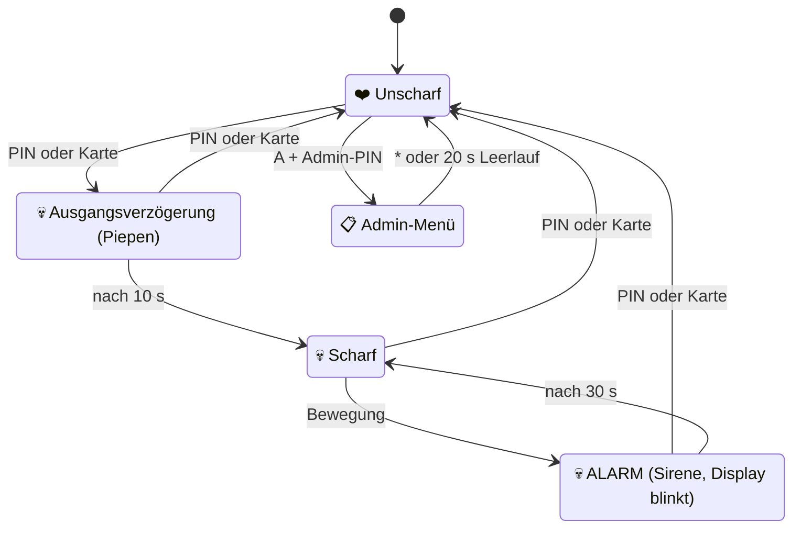
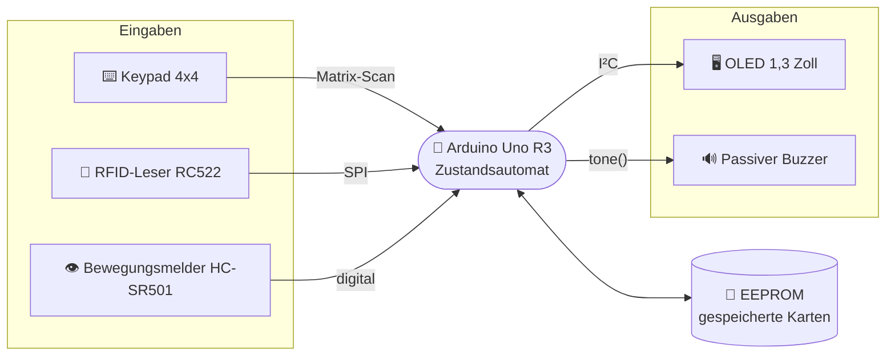

<!-- Diese Seite wird automatisch aus dem Ordner wiki/ im Repository erzeugt. Änderungen im Wiki-Editor werden beim nächsten Abgleich überschrieben. Bearbeiten: https://github.com/BBZ-AIFS51/LF7-Projekt_GAS/tree/main/wiki -->
# 3 · 🎛️ Funktionsbeschreibung

Wie die fertige Anlage aus Sicht der Anwender funktioniert und wie die Bauteile
dabei zusammenspielen. Wie das im Code umgesetzt ist, steht in
[Kapitel 7](Wichtige-Codeabschnitte).

## Einsatzort

Die Anlage besteht aus zwei Teilen. Das **Bedienteil** mit Tastenfeld, Display,
Kartenleser und Buzzer hängt außen neben der Tür. Das **Sensorteil** mit dem
Bewegungsmelder sitzt innen im Raum und schaut auf den Eingang. Weil der Sensor
nicht durch die Wand sieht, löst niemand Alarm aus, der draußen am Tastenfeld
steht. Erst wer den Raum betritt, wird erkannt.

   
  Montage von oben: Der Erfassungsbereich des Sensors deckt den Eingang ab

## Die Anlage im Alltag

| # | Situation | Was die Person tut | Was die Anlage macht |
|:---:|---|---|---|
| 1 | Die Anlage ist **unscharf** | – | Display zeigt ein ❤️ Herz. Bewegung im Raum wird ignoriert. |
| 2 | Den Raum verlassen | PIN eintippen und mit <kbd>#</kbd> bestätigen **oder** Karte an den Leser halten | Heller Doppelton, Display zeigt 💀 und einen Countdown. 10 Sekunden lang piept es jede Sekunde: Zeit, den Raum zu verlassen. |
| 3 | Die Anlage ist **scharf** | – | Display zeigt dauerhaft 💀. Der Bewegungsmelder ist aktiv. |
| 4 | Jemand betritt den Raum | – | **Alarm:** schrille Sirene, das Display blinkt mit 💀 und zeigt die Restzeit. Nach 30 Sekunden ist die Sirene aus, die Anlage bleibt scharf. |
| 5 | Zurückkommen | PIN + <kbd>#</kbd> oder Karte | Heller Doppelton, ❤️ Herz: wieder unscharf. Ein laufender Alarm wird damit sofort beendet. |
| 6 | Falsche PIN oder unbekannte Karte | – | Rauer, tiefer Brummton, Display zeigt kurz ein ✖. |
| 7 | **3 Fehlversuche** hintereinander | – | Sofort Alarm, auch wenn die Anlage gerade unscharf war. |
| 8 | Falsche Eingabe während des Alarms | – | Wird ignoriert, die Sirene läuft weiter. Nur die richtige PIN oder eine bekannte Karte beendet den Alarm. |

> [!TIP]
> Die PIN erscheint beim Tippen nur als `*`. Eine halb getippte PIN verschwindet
> nach 10 Sekunden ohne Tastendruck von selbst, mit <kbd>*</kbd> lässt sie sich
> sofort löschen.

## Zustände der Anlage

Die Anlage ist immer in genau einem von fünf Zuständen. Was eine Eingabe
bewirkt, hängt vom aktuellen Zustand ab.

Außerhalb des Alarms gilt: **3 falsche Eingaben** (PIN, Admin-PIN oder
unbekannte Karte) lösen sofort den Alarm aus.

## Rückmeldungen

Das Display zeigt bewusst keinen Text, sondern Symbole. Zusammen mit den Tönen
ist auf einen Blick klar, was gerade passiert.

| Ereignis | Display | Ton |
|---|---|---|
| Unscharf | ❤️ Herz | – |
| Ausgangsverzögerung | 💀 Totenkopf + Countdown | kurzer Piep jede Sekunde |
| Scharf | 💀 Totenkopf | – |
| Alarm | 💀 Totenkopf, ganzer Bildschirm blinkt, Countdown | Sirene, auf- und abschwellend |
| Taste gedrückt | `*` pro Ziffer | kurzer Klick |
| Richtige PIN oder bekannte Karte | neues Symbol | heller Doppelton |
| Falsche PIN oder unbekannte Karte | ✖ | rauer, tiefer Brummton |

## Karten verwalten (Admin-Menü)

Welche Karten die Anlage schalten dürfen, wird direkt am Gerät festgelegt, ganz
ohne PC. Die Karten bleiben gespeichert, auch wenn der Strom weg ist.

1. Anlage ist unscharf: <kbd>A</kbd> drücken, Admin-PIN eintippen, <kbd>#</kbd>.
2. Im Menü:
   - <kbd>1</kbd> **Karte anlernen:** neue Karte an den Leser halten. Das Display meldet *Saved*, *Known* (schon gespeichert) oder *Full* (8 Karten erreicht).
   - <kbd>2</kbd> **Karten anzeigen:** mit <kbd>#</kbd> blättern, mit <kbd>D</kbd> die angezeigte Karte löschen.
   - <kbd>*</kbd> zurück bzw. Menü verlassen. Nach 20 Sekunden ohne Eingabe schließt das Menü von selbst.

Eine falsche Admin-PIN zählt als Fehlversuch, genau wie eine falsche normale PIN.

## Tastenbelegung

| Taste | Wirkung |
|---|---|
| <kbd>0</kbd> … <kbd>9</kbd> | PIN eingeben (Anzeige nur als `*`) |
| <kbd>#</kbd> | Eingabe bestätigen |
| <kbd>*</kbd> | Eingabe löschen · im Admin-Menü: zurück |
| <kbd>A</kbd> | im Zustand UNSCHARF: Admin-Menü (danach Admin-PIN + <kbd>#</kbd>) |
| <kbd>B</kbd> | im Zustand UNSCHARF: RFID-Leser neu starten, falls er hängt |
| <kbd>C</kbd> | ohne Funktion |
| <kbd>D</kbd> | im Admin-Menü: angezeigte Karte löschen |
| 💳 Karte | wirkt wie die richtige PIN, wenn sie gespeichert ist |

## Zusammenspiel der Bauteile

Der Arduino fragt die drei Eingaben ständig reihum ab, entscheidet im
Zustandsautomaten und steuert die zwei Ausgaben. Die erlaubten Karten liegen im
internen EEPROM des Arduino.

Die ausführliche Bedienungsanleitung für Endanwender gibt es als
[PDF](https://github.com/BBZ-AIFS51/LF7-Projekt_GAS/blob/main/Anleitung/Mini%20Security%20System%20Manual.pdf).
Ausprobieren lässt sich alles auch ohne Gerät im
[3D-Modell](https://bbz-aifs51.github.io/LF7-Projekt_GAS/): Dort läuft die
gleiche Logik wie in der Firmware.

---

← [2 Idee und Zielsetzung](Idee-und-Zielsetzung) · [4 Verwendete Bauteile](Verwendete-Bauteile) →
