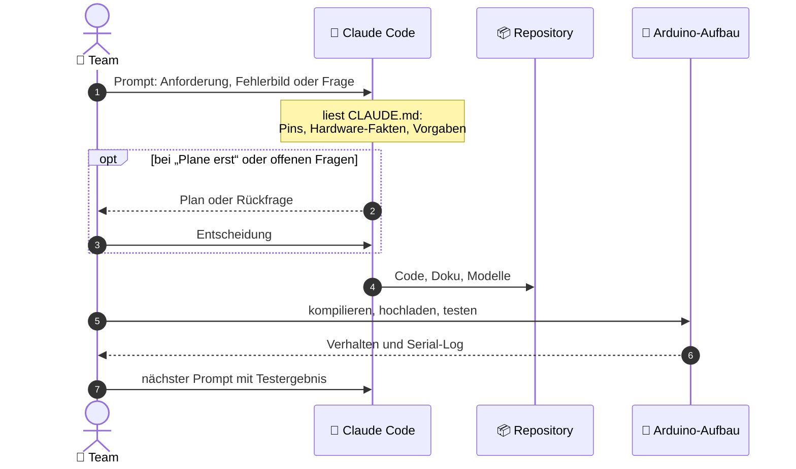

<!-- Diese Seite wird automatisch aus dem Ordner wiki/ im Repository erzeugt. Änderungen im Wiki-Editor werden beim nächsten Abgleich überschrieben. Bearbeiten: https://github.com/BBZ-AIFS51/LF7-Projekt_GAS/tree/main/wiki -->
# 🤖 KI-Einsatz

Anhang

Ein großer Teil von Code, Grafiken und Doku ist mit dem KI-Assistenten
**Claude Code** entstanden. Diese Seite zeigt offen, wie wir die KI eingesetzt
haben, wo ihre Grenzen lagen und was wir selbst gemacht und geprüft haben.

## Vorgaben zum KI-Einsatz

| Vorgabe | Wie wir sie einhalten |
|---|---|
| KI ist als Hilfsmittel erlaubt (Recherche, Fehlersuche, Programmieren) | Claude Code hat beim Programmieren, bei der Fehlersuche und beim Gehäuse-Entwurf geholfen. Aufgebaut, getestet und entschieden haben wir. |
| Prompts werden nicht in der Dokumentation abgedruckt | Der [Entwicklungsverlauf](Entwicklungsverlauf) beschreibt nur, was wir erreichen wollten und was herauskam. |
| Jedes Gruppenmitglied kann den Code und die Entscheidungen erklären | Die Kernstellen sind in [Kapitel 7](Wichtige-Codeabschnitte) erklärt, die Begründungen in [Kapitel 8](Herausforderungen). ✏️ TODO (Team): Wer präsentiert welchen Teil? |

## Arbeitsweise

Die Datei [`CLAUDE.md`](https://github.com/BBZ-AIFS51/LF7-Projekt_GAS/blob/main/CLAUDE.md)
ist das „Gedächtnis“ des Projekts. Darin stehen die echte Pinbelegung, am Aufbau
geprüfte Hardware-Fakten (z. B. Display-Controller SH1106, knapper SRAM) und
Regeln wie „Kommentare auf Englisch“ oder „kein Feature-Overkill“. Claude Code
liest sie bei jedem Prompt mit. So mussten wir nicht jedes Mal alles neu
erklären, und die KI hat keine Pins erfunden.

## Wer hat was gemacht?

| 👥 Team | 🤖 Claude Code |
|---|---|
| Projektidee und Anforderungen | Firmware nach unseren Anforderungen geschrieben |
| Hardware besorgt, aufgebaut, verdrahtet | Fehler aus unseren Beschreibungen und Logs diagnostiziert |
| Bring-up-Test und Display-Typ (SH1106) am Aufbau ermittelt | Test-Sketches zum Eingrenzen von Fehlern |
| Jede Version kompiliert, hochgeladen und getestet | README, Grafiken und 3D-Modell erstellt |
| Fehlerbilder beschrieben (Display-Datenblatt, Serial-Log) | Gehäuse geplant und in OpenSCAD modelliert |
| Entscheidungen bei Rückfragen getroffen | Protokoll im Entwicklungsverlauf geführt |
| Anregungen der Lehrkraft eingebracht | Begriffe erklärt (Kollisionserkennung, Rechtevergabe) |
| ✏️ TODO | |

> [!NOTE]
> ✏️ **TODO (Team):** Tabelle prüfen und ergänzen. Was habt ihr selbst
> geschrieben oder geändert, ohne KI? Was habt ihr von der KI übernommen und
> danach angepasst?

## Grenzen der KI – und wie wir damit umgegangen sind

| Grenze | Beispiel | Unser Umgang |
|---|---|---|
| **Kann nicht am echten Gerät testen** | Kein Sketch wurde von der KI kompiliert, sie hatte keinen Zugriff auf Arduino oder Hardware ([Schritt 1](Entwicklungsverlauf#-schritt-1--auftrag-komplette-firmware)) | Wir haben jede Version selbst gebaut und getestet |
| **Fehler im eigenen Code** | Der Fehlerton hat die Sirene abgebrochen, das ist erst beim Testen aufgefallen ([Schritt 16](Entwicklungsverlauf#-schritt-16--falsche-eingabe-bricht-den-alarm-ab)) | Fehler genau beschrieben, Korrektur geprüft |
| **Abweichung von der Anforderung** | Gefordert war ein Fehlerton von 3 s, im Code stehen 2 s. Die KI hat die Abweichung später selbst angemerkt ([Schritt 8](Entwicklungsverlauf#-schritt-8--3d-animationen-und-neue-readme)) | ✏️ TODO (Team): bewusst so gelassen oder anpassen? |
| **Daten statt Messung** | Die Gehäusemaße stammen aus Datenblättern, nicht vom echten Aufbau ([Schritt 10](Entwicklungsverlauf#-schritt-10--gehäuse-für-den-3d-druck)) | ✏️ TODO (Team): vor dem Druck nachmessen |
| **Kennt die Hardware nur aus unseren Angaben** | Der Display-Fehler hing davon ab, welchen Controller das Display hat ([Schritt 2](Entwicklungsverlauf#-schritt-2--display-zeigt-pixelmüll)) | Hardware-Fakten am Aufbau geprüft und in `CLAUDE.md` festgehalten |

## Wie wir die Ergebnisse geprüft haben

> [!NOTE]
> ✏️ **TODO (Team):** Beschreiben, wie ihr sichergestellt habt, dass der Code
> tut, was er soll. Zum Beispiel: Testfälle am Gerät durchgespielt (richtige
> und falsche PIN, 3 Fehlversuche, Bewegung im scharfen und unscharfen Zustand,
> Karte anlernen und löschen), Serial-Ausgaben kontrolliert, Code gelesen und
> nachvollzogen.

## Unsere Einschätzung

> [!NOTE]
> ✏️ **TODO (Team):** Gehört zur [Reflexion](Fazit-und-Ausblick#reflexion). Was hat die
> KI gut gemacht? Wo musstet ihr nachhelfen? Was habt ihr dabei gelernt, z. B.
> über Speicher auf Mikrocontrollern oder über gutes Prompten? Würdet ihr die
> KI wieder so einsetzen?
