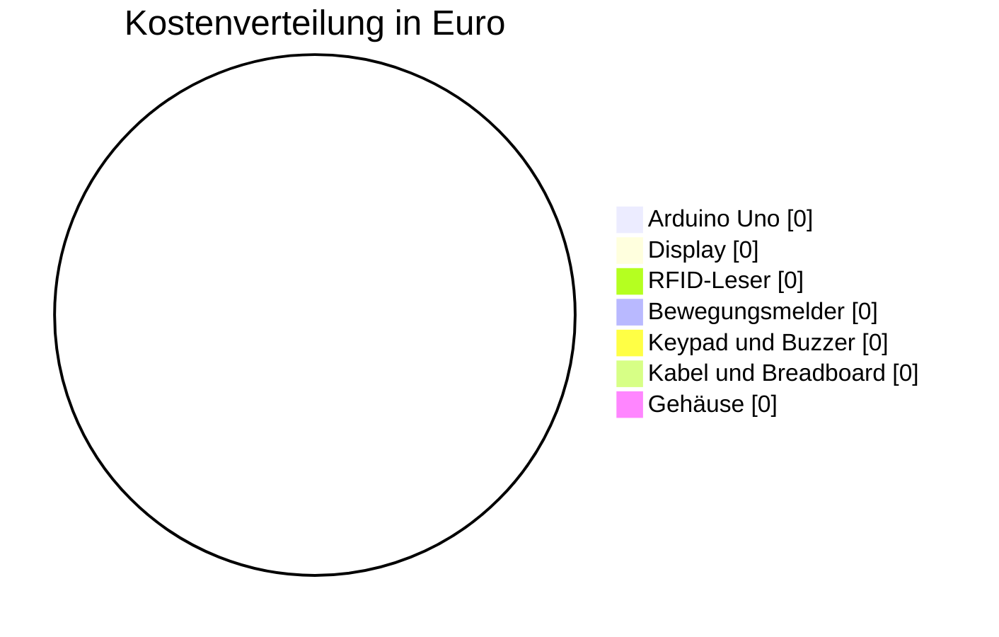

<!-- Diese Seite wird automatisch aus dem Ordner wiki/ im Repository erzeugt. Änderungen im Wiki-Editor werden beim nächsten Abgleich überschrieben. Bearbeiten: https://github.com/BBZ-AIFS51/LF7-Projekt_GAS/tree/main/wiki -->
# 💶 Kosten

Anhang

Alle Bauteile und Materialien mit Preis. Grundlage sind die Hardware-Tabelle
im [README](https://github.com/BBZ-AIFS51/LF7-Projekt_GAS#hardware) und die
Einkaufsliste in der [Gehäuse-Anleitung](https://github.com/BBZ-AIFS51/LF7-Projekt_GAS/blob/main/MDs/gehaeuse.md#schritt-4--einkaufsliste).

> [!IMPORTANT]
> ✏️ **TODO (Team):** Preise und Bezugsquellen eintragen. Was von der Schule
> gestellt wurde, mit „gestellt“ markieren und trotzdem einen Richtpreis
> angeben, damit die Gesamtkosten aussagekräftig sind.
>
> Die [Teile.xlsx](https://github.com/BBZ-AIFS51/LF7-Projekt_GAS/blob/main/Teile.xlsx)
> im Repository enthält bisher nur Uno, Bewegungsmelder und Keypad. Am besten
> dort vervollständigen und hier die Übersicht pflegen.

## Elektronik

| Anz. | Bauteil | Hersteller / Typ | Bezugsquelle | Einzelpreis | Summe |
|:---:|---|---|---|---:|---:|
| 1 | Mikrocontroller | Arduino Uno R3 | ✏️ | ✏️ € | ✏️ € |
| 1 | Tastenfeld 4x4 | Folien-Keypad | ✏️ | ✏️ € | ✏️ € |
| 1 | OLED-Display 1,3", 128x64, I²C | Controller SH1106 | ✏️ | ✏️ € | ✏️ € |
| 1 | RFID-Leser mit Karte und Schlüsselanhänger | RC522 (13,56 MHz) | ✏️ | ✏️ € | ✏️ € |
| 1 | Bewegungsmelder (PIR) | Joy-IT SEN-HC-SR501 | ✏️ | ✏️ € | ✏️ € |
| 1 | Passiver Buzzer | ✏️ | ✏️ | ✏️ € | ✏️ € |
| 1 | Breadboard bzw. Mini-Breadboard (170 Kontakte) | ✏️ | ✏️ | ✏️ € | ✏️ € |
| 1 | Jumper-Kabel (Set) | ✏️ | ✏️ | ✏️ € | ✏️ € |
| 1 | Stromversorgung: 9-V-Batterie mit Hohlstecker oder USB-Netzteil 5 V | ✏️ | ✏️ | ✏️ € | ✏️ € |
| | | | | **Zwischensumme** | **✏️ €** |

## Gehäuse

| Anz. | Teil | Wofür | Bezugsquelle | Einzelpreis | Summe |
|:---:|---|---|---|---:|---:|
| ✏️ g | Filament (PLA) | 5 Druckteile | ✏️ | ✏️ €/kg | ✏️ € |
| 8 | Senkkopf-Schraube 3 × 12 mm | Frontplatten | ✏️ | | ✏️ € |
| 4 | Linsenkopf-Schraube 3 × 8 mm | Arduino Uno | ✏️ | | ✏️ € |
| 2 | Schraube M2 × 6 mm | Bewegungsmelder | ✏️ | | ✏️ € |
| 2 | Senkkopf-Schraube 3 × 10 mm | Sensor auf Keil | ✏️ | | ✏️ € |
| 4 | Holzschraube 3,5–4 mm mit Dübel | Wandmontage | ✏️ | | ✏️ € |
| 1 | 3-adriges Kabel mit Dupont-Steckern | Verbindung zum Sensorteil | ✏️ | | ✏️ € |
| | | | | **Zwischensumme** | **✏️ €** |

> [!TIP]
> Den Filamentverbrauch zeigt der Slicer nach dem Slicen an (in Gramm).
> Kosten = Gramm × Preis pro kg / 1000.

## Gesamtkosten

| Bereich | Kosten |
|---|---:|
| Elektronik | ✏️ € |
| Gehäuse | ✏️ € |
| **Gesamt** | **✏️ €** |

<!--
  Nach dem Ausfüllen: Den folgenden Block (ohne die Kommentarzeichen) hier
  einfügen und die Zahlen ersetzen. GitHub zeichnet daraus ein Tortendiagramm.

-->

> [!NOTE]
> ✏️ **TODO (Team):** Wenn die Preise feststehen, das vorbereitete
> Tortendiagramm einblenden. Es steht als Kommentar im Quelltext dieser Seite
> (im Repository in `wiki/Kosten.md` ganz unten).
