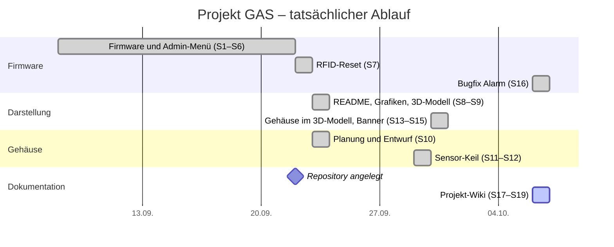

<!-- Diese Seite wird automatisch aus dem Ordner wiki/ im Repository erzeugt. Änderungen im Wiki-Editor werden beim nächsten Abgleich überschrieben. Bearbeiten: https://github.com/BBZ-AIFS51/LF7-Projekt_GAS/tree/main/wiki -->
# 📅 Zeitplan

Anhang

Wie das Projekt geplant war und wie es tatsächlich gelaufen ist.

## Geplanter Ablauf (Soll)

> [!NOTE]
> ✏️ **TODO (Team):** Gab es zu Beginn eine Planung? Dann hier eintragen.
> Wenn nicht, ehrlich schreiben: „Es gab keine formale Planung, wir sind
> schrittweise vorgegangen.“ Das ist auch ein guter Punkt für die
> [Reflexion](Fazit-und-Ausblick#reflexion).

| Phase | geplant bis | tatsächlich fertig |
|---|---|---|
| Idee und Anforderungen | ✏️ TODO | ✏️ TODO |
| Bauteile besorgen und Aufbau | ✏️ TODO | ✏️ TODO |
| Firmware Grundfunktion | ✏️ TODO | 08.09.2026 |
| Erweiterungen (RFID, Admin-Menü) | ✏️ TODO | 22.09.2026 |
| Gehäuse | ✏️ TODO | ✏️ TODO (Druck) |
| Dokumentation und Präsentation | ✏️ TODO | ✏️ TODO |

## Tatsächlicher Ablauf (Ist)

Rekonstruiert aus dem [Entwicklungsverlauf](Entwicklungsverlauf) und der
Git-Historie. „S“ steht für die Nummer des Arbeitsschritts im Entwicklungsverlauf.

> [!NOTE]
> Die Schritte 1–6 sind im Protokoll nicht einzeln datiert. Laut Kopf des
> Entwicklungsverlaufs fand die erste Sitzung am 08.09.2026 statt, Schritt 7 ist
> vom 22.09.2026. Der Balken zeigt deshalb den ganzen Zeitraum dazwischen.
>
> ✏️ **TODO (Team):** Falls ihr die genauen Tage noch wisst, Balken aufteilen.
> Außerdem fehlen Phasen, die nicht im Protokoll stehen: Hardware-Aufbau,
> Bring-up-Test, RFID-Umbau der Verdrahtung, Gehäuse-Druck. Format für einen
> neuen Balken: `Name :done, 2026-09-15, 2d`

## Meilensteine

| Datum | Meilenstein |
|---|---|
| ✏️ TODO | Projektstart, Bauteile vollständig |
| ✏️ TODO | Alle Bauteile laufen einzeln (`hardware_test`) |
| 08.09.2026 | Erste komplette Firmware: Zustandsautomat, PIN, Töne, Herz und Totenkopf |
| ✏️ TODO | RFID-Leser verdrahtet, Karten schalten scharf und unscharf |
| 22.09.2026 | Repository auf GitHub, Admin-Menü und RFID-Reset fertig |
| 23.09.2026 | Neue README mit Animationen, 3D-Modell online, erster Gehäuse-Entwurf |
| 29.09.2026 | Gehäuse mit 60°-Keil für den Bewegungsmelder |
| 30.09.2026 | Gehäuse im 3D-Modell, Banner und Social Preview |
| 06.10.2026 | Bugfix: Falsche Eingabe bricht den Alarm nicht mehr ab · Projekt-Wiki |
| ✏️ TODO | Gehäuse gedruckt und montiert |
| ✏️ TODO | Abgabe und Präsentation |
